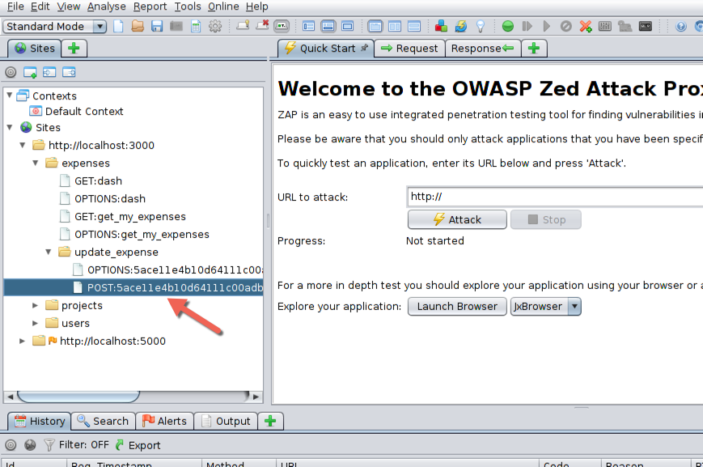
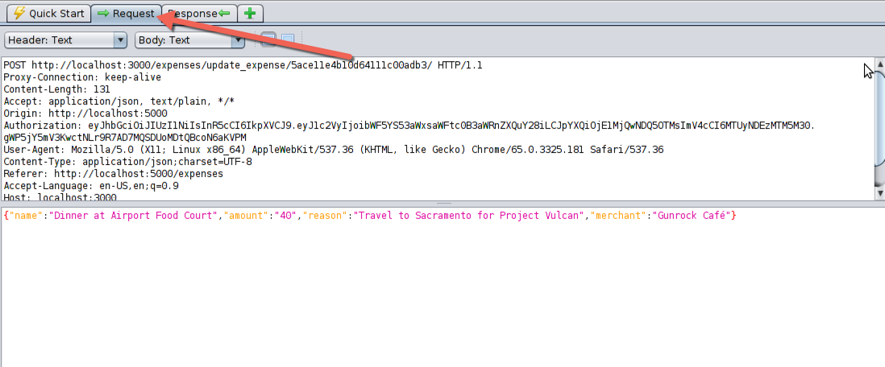

## Insecure Direct Object Reference - Mass Assignment
### Pre-Processing
* Start the NodeJS Stack by running the following commands:
	* Open up the Terminal
	* Command: `cd /home/we45/Downloads/`
	* Command: `start_node.sh`
	* It will run a full stack deployment of a Front-end service, a Web Service and a Datbase. The Front-end service runs on port 5000, the Backend Web Service runs on port 3000.
* Open the application `OWASP` on your Desktop.
* Open Chrome from your Desktop
* Go to the FoxyProxy icon as you can see from here

* In **Select Mode**, choose OWASP ZAP and Close. This turns the icon Blue
* In the Chrome address bar, type "http://localhost:5000"
* Now, if you go back to the OWASP ZAP Window, it would have started capturing requests and responses from Localhost.

### Exercise
* The objective of this attack is to get an expense approved, even without it being approved by a manager
* Let's Update an expense.
* Login with Maya's email and password: `maya.williams@widget.co` and password: `superman123`.
* In the top bar, you should find "Manage Expenses". Click on that.
* You can add and update or only Update an existing expense, all the while the traffic is captured by OWASP ZAP
* Once this is done, go to OWASP ZAP and open up the following request from the side bar

Right click anywhere on the request pane, and select the following option:

Tamper with the request and add another field to this with `"isApproved": true` as shown below

And click "Send" in the request editor

If everything has gone well, you can refresh the expense page in Chrome and you should see that the expense that you tampered with, has been approved

### Vulnerable Code - Insecure Direct Object Reference
* Open Terminal
* Command: `cd /home/we45/Downloads/sources/Cut-The-Funds-NodeJS`
* Command: `mousepad controllers/expense.controller.js`
* Mousepad opens up
	* goto line 149 and look for the Mass Assignment Vulnerability

### Close Lab
* On the terminal that you ran the `start_node.sh` run `Ctrl + C` to shutdown the app.
* Now run `stop_node.sh` to gracefully bring down the stack.
