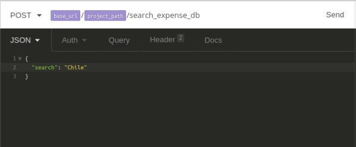
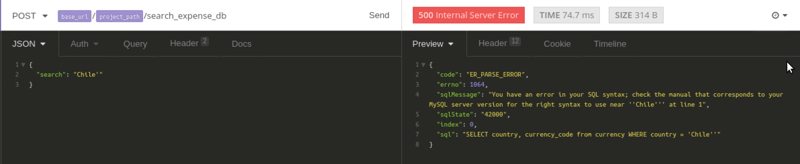

## SQL Injection
* Start the NodeJS Stack by running the following commands:
	* Open up the Terminal
	* Command: `start_node.sh`
	* Wait for a few seconds till the stack starts up
	* Open the application `Insomnia` on your Desktop. This allows you to interact with the Web Service. Its an HTTP Client

### Exercise Instruction
In Insomnia, you should automatically be on the Cut the Funds Workspace. This is the list of requests and responses for the webservice. You'll be using this tool to interact with the API. In the sidebar, click on the "Login Manager" request


Execute the Request, by clicking "Send" in the main window


If you are successfully logged in, you should get an 200 Response with an Authorization Token. Copy that token and paste it in Mousepad/etc


Now in the sidebar, go to the SQLi Search Request. Ensure that you add the copied Authorization Token in Header Tab in the Request page


In the main page. you can change the search json attribute to any value you want. Search for something simple like a country for now.



Now try forcing an error, by injecting a single quote in the search param. It should throw an error. If it does, you can be sure that the app you are testing is vulnerable to SQL Injection

`Chile'`



Now that we have established that SQL Injection is possible, let's start exploring SQL Injection Attacks against the application

	```
	India' UNION ALL SELECT null, (SELECT @@datadir)--
	India' UNION ALL SELECT null, (SELECT @@version)--
	India' UNION ALL SELECT null, (SELECT user())--
	India' UNION ALL SELECT null, (SELECT database())--
	India' UNION ALL SELECT null,(SELECT concat(user,':',authentication_string) from mysql.user LIMIT 1)--
	```
* Each of the above is an SQL Injection payload. Copy each payload and inject them in the search parameter by pasting the payload in the search field in the top right corner. Click the search button to execute the payload
* Observe the results

### Vulnerable Code - SQL Injection
* Open Terminal
* Command: `cd /home/we45/Downloads/sources/Cut-The-Funds-NodeJS`
* Command: `mousepad controllers/project.controller.js`
* Mousepad opens up
	* goto line 125 and look at the vulnerable SQL call

### Close Lab
* On the terminal that you ran the `start_node.sh` run `Ctrl + C` to shutdown the app.
* Now run `stop_node.sh` to gracefully bring down the stack.

